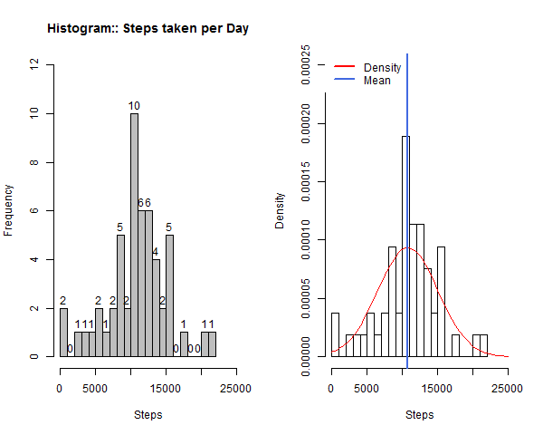
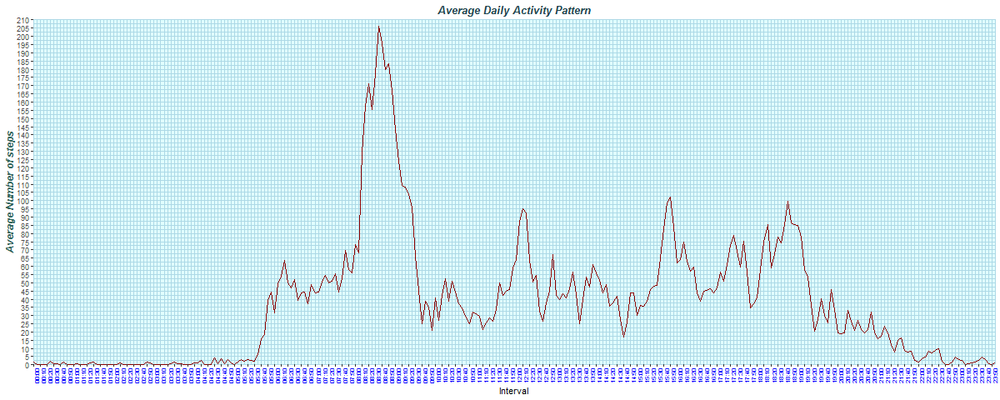
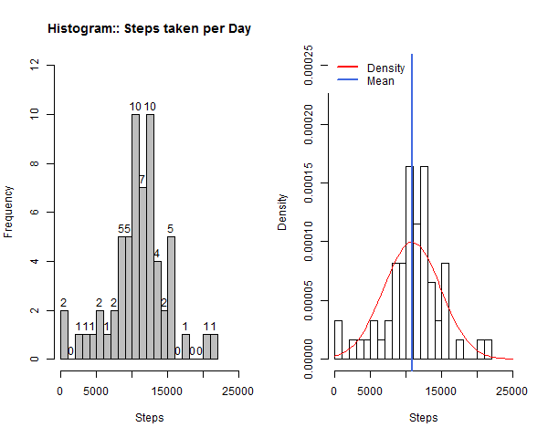
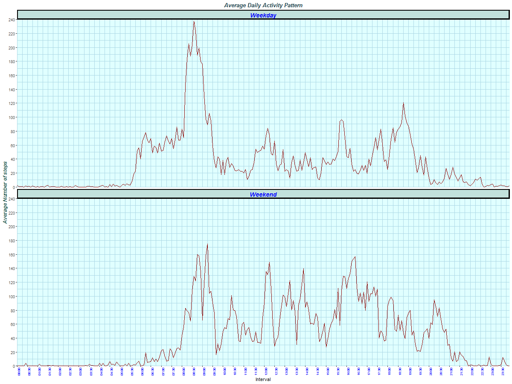

---
title: "Activity Analysis Report"
author: "Rahul Sankar Brahmachari"
date: "May 27, 2019"
output: 
  html_document:
    keep_md: true
--- 

```{r setup, include=FALSE}
knitr::opts_chunk$set(echo = TRUE)
knitr::opts_chunk$set(comment = NA)
knitr::opts_chunk$set(fig.path = "./figures/")
```
## 1. Introduction

It is now possible to collect a large amount of data about personal movement using activity monitoring devices such as a [Fitbit](http://www.fitbit.com/), [Nike Fuelband](http://www.nike.com/us/en_us/c/nikeplus-fuelband), or [Jawbone Up](https://jawbone.com/up). These type of devices are part of the “quantified self” movement – a group of enthusiasts who take measurements about themselves regularly to improve their health, to find patterns in their behavior, or because they are tech geeks. But these data remain under-utilized both because the raw data are hard to obtain and there is a lack of statistical methods and software for processing and interpreting the data.

This analytic report uses a comma-separated-value (CSV) file with 17,568 observations from the course web site: [Activity monitoring data ](https://d396qusza40orc.cloudfront.net/repdata%2Fdata%2Factivity.zip) [52K] that consists of data representing the number of steps taken in 5 minute intervals each day from an anonymous individual collected using a personal activity monitoring device for two months during the months of October and November, 2012. 

The three variables included in this dataset are:

1. steps:    Number of steps taking in a 5-minute interval (missing values are coded as NA),
2. date:     The date on which the measurement was taken in YYYY-MM-DD format, and
3. interval: Identifier for the 5-minute interval in which measurement was taken.

This document, for peer assessments 1 of course "Reproducible Research" on coursera, presented as report along with the data and relevant code using R markdown that can be processed by knitr and be transformed into an HTML file. 

## 2. Data

We first check for the  comma-separated-value (CSV) file called "activity.csv" in the present working directory; and if the file is not present there then we download the Source data from the specified URL ("https://d396qusza40orc.cloudfront.net/repdata%2Fdata%2Factivity.zip") over the internet in a zipped archive format to the current working directory and unzip that to get our source data file "activity.csv". 

We then proceed to load the data from the file to a data frame "Source_Data" in computer memory and convert two columns - "date" and "interval" for enhanced readability. 

```{r Sorce_Data_loading}
if (!file.exists("./activity.csv")) {
      ## File is not present; so we download the Source data using URL
      ## URL for the Source Data
      fileUrl <- 
        "https://d396qusza40orc.cloudfront.net/repdata%2Fdata%2Factivity.zip"

      ## Download as "Activity.zip" on the current directory
      destfile = "./Activity.zip"

      ## Download and saved as "Activity.zip"" in the present working directory
      download.file(fileUrl, destfile)
      
      ## Unzip the downloaded Source Data
      unzip(destfile)
      
      ## Remove the zip archived file
      unlink(destfile)
      
}

## Load the Source Data from file to R data frame
Source_Data <- read.csv("./activity.csv")

## Convert columns to enhance readability
## date column using as.Date as the format is YYYY-MM-DD in the file
Source_Data$date <- as.Date(Source_Data$date)
## interval column as Hour:Minute 
Source_Data$interval <- format(strptime(sprintf("%04d", Source_Data$interval),                                                 format="%H%M"), 
                                        format = "%H:%M")

```

Here is a quick overview of the data: 

- There are a total ```r nrow(Source_Data)``` rows and ```r  ncol(Source_Data)```  columns: ```r colnames(Source_Data)```.

- ```r length(unique(Source_Data$interval))``` "5-Minute" intervals (```r min(Source_Data$interval)``` - ```r max(Source_Data$interval)```) per day. 

- ```r length(unique(Source_Data$date))``` days spanning the months of October and November, 2012 (from ```r format(min(Source_Data$date),"%A %B %d, %Y")``` to ```r format(max(Source_Data$date),"%A %B %d, %Y")```).

- ```r sum(is.na(Source_Data$steps))``` missing values for steps. 


```{r Sorce_Data_overvew}
## Internal structure of our data frame:
  str(Source_Data)

## First 10 Rows: 
  head(Source_Data,10)

## Last 10 Rows: 
  tail(Source_Data,10)

## A Quick summary of our data frame:
  summary(Source_Data)
```


## 3. Data Analysis

Let us dive deep and started our analysis to answer a few questions:

### 3.1 What is mean total number of steps taken per day?

Let us calculate the total number of steps taken per day ignoring the missing values (Steps values represented by NA). We got 53 days of summarized data out of total 61 days that were present due to missing values in the dataset.

```{r Steps_Per_Day}

## Summarized the data by date to find out the total number of steps taken per day
TSPD <- aggregate(steps ~ date,Source_Data, sum)
## Display the calculated total number of steps taken each day
TSPD
```

Let us plot our finding with a histogram:

```{r Histogram_Steps_Per_Day, results="hide"}
## could have been better to turn off the echo for plots generations but kept ## it with echo on as advised for easier evaluation by peers.  
## Create the figure directory if not present to save or plots
if (!dir.exists("./figures")) {dir.create("./figures")}

## Save the plot as "PNG" file
png("./figures/plot1.png", width=600, height=480)

## put two histograms with frequency and distribution both
par(mfrow=c(1,2))
Plot_H <- hist(TSPD$steps,breaks=25,col="grey", ylim=range(pretty(c(0, 12))), xlim=range(pretty(c(min(TSPD$steps), max(TSPD$steps)))),xlab="Steps", main="Histogram:: Steps taken per Day")
text(Plot_H$mids,Plot_H$counts,labels=Plot_H$counts, adj=c(0.5, -0.5))
hist(TSPD$steps, breaks=25, freq=FALSE,  ylim=range(pretty(c(0, 0.00021))), xlim=range(pretty(c(min(TSPD$steps), max(TSPD$steps)))),xlab="Steps",  main="")
 curve(dnorm(x, mean=mean(TSPD$steps), sd=sd(TSPD$steps)), add=TRUE, col="red")
 abline(v = mean(TSPD$steps), col = "royalblue", lwd = 2)
legend(x = "topleft", # location of legend within plot area
 c("Density", "Mean"),  col = c("red", "royalblue"),lwd = c(2,2), box.lty=0)
dev.off()

```

```{r Histogram1, echo=FALSE, fig.cap="Fig. 1: Histogram ~ Steps taken per Day along with Mean and Density Distribution Curve", out.width = '100%'}

```

***

We have calculated the mean (```r format(mean(TSPD$steps),scientific=FALSE)``` ) and median (```r format(median(TSPD$steps),scientific=FALSE)``` ) of the total number of steps taken per day from our summarized data ignoring the missing values.

### 3.2 What is the average daily activity pattern?

Let us calculate the average number of steps taken on each "5-minute" interval across all the days again ignoring the missing values (Steps values represented by NA). We got 288 intervals of summarized data.

```{r Avg_Steps_Per_Interval}

## Summarized the data by intervals across all the days to find out the average number of steps taken in each "5-minute" interval
ASPI <- aggregate(steps ~ interval, Source_Data, mean)
## Display the calculated average number of steps taken on each 288 intervals across all the days
ASPI
```

Let us put our finding with a time series plot (i.e. type="l") of the 5-minute interval on x-axis and the average number of steps taken, averaged across all days on y-axis:

```{r timeseries_Avg_Steps_Per_Interval, message=FALSE, warning=FALSE,  results="hide"}
## If 'ggplot2' package is not available, then install it
   if (!require(ggplot2)) {install.packages('ggplot2')}
        
  ## Load package ggplot2
    library(ggplot2)

## If 'scales' package is not available, then install it
   if (!require(scales)) {install.packages('scales')}
        
  ## Load package scales for X-Axis ticks 
    library(scales)

## Save the plot as "PNG" file
png("./figures/plot2.png", width=1200, height=480)

YMax <- round(max(ASPI$steps)+5,-1)
ggplot(ASPI, 
   aes(x=as.POSIXct(ASPI$interval, format="%H:%M", tz="UTC"), y=steps)
) +
scale_x_datetime(date_breaks = "10 min", labels = date_format("%H:%M"),
                    expand = c(0,0)) +
scale_y_continuous(breaks = seq(0,YMax,5), limits = c(0,YMax),
                      expand = c(0, 0))+  
geom_line(color="darkred")+
labs(title="Average Daily Activity Pattern", x="Interval", 
        y="Average Number of steps") +  
theme(
  panel.background=element_rect(fill= "lightcyan", colour = "lightcyan", 
                                size = 0.5, linetype = "solid"),
  plot.title = element_text(colour="#1E434C", face = "bold.italic", 
                            hjust = 0.5),
  axis.text.x = element_text(angle = 90, vjust = 1.0, hjust = 1.0,
                             size=7,colour ="blue"),
  axis.title.y = element_text(color="#34675C", face="bold.italic", size=12),
  panel.grid = element_line( linetype = 'solid', colour="lightblue")
)

dev.off()

```


```{r TimeSeries1, echo=FALSE, fig.cap="Fig. 2: TimeSeries ~ Average Daily Activity", out.width = '100%'}

```

***

We also find out that the 5-minute interval starting at ```r ASPI[which.max(ASPI$steps),"interval"]```, on average across all the days in the dataset, contains the maximum number of steps(```r max(ASPI$steps)``` steps). 


### 3.3 Imputing missing values

Missing data (or missing values) is defined as the data value that is not stored for a variable in the observation of interest. Missing data present various problems. First, the absence of data can cause bias in the estimation of parameters. Second, it can reduce the representativeness of the samples. Third,  the lost data reduces statistical power, which refers to the probability that the test will reject the null hypothesis when it is false. These distortions arises out of the missing data not only complicate the analysis but may even threaten the validity of the conclusions.

There are ```r sum(!complete.cases(Source_Data))``` missing values (coded as NA) for "steps" in our source data.

Before devising a strategy for filling in all of the missing values in the dataset, a closer look reveals two outliers:

1. date "2012-10-02" which has only two intervals with non-zero data summing up of a total of 126 steps for the whole day; and 

2. date "2012-11-15" which also has only two intervals with non-zero data summing up of a total of only 41 steps for the whole day


```{r suspecious_data}
## date "2012-10-02" which has only two intervals with non-zero data summing up of a total of 126 steps for the whole day 
TSPD[TSPD$date=='2012-10-02',]
Source_Data[Source_Data$date=='2012-10-02' & Source_Data$steps != 0 ,]

##date "2012-11-15" which also has only two intervals with non-zero data summing up of a total of only 41 steps for the whole day
TSPD[TSPD$date=='2012-11-15',]
Source_Data[Source_Data$date=='2012-11-15' & Source_Data$steps != 0 ,]
```

As this assignment does not demand too sophisticated a strategy to fill the missing values; we have not delved much time to analyze the nature of the missing values i.e. whether they are missing completely at random (MCAR), missing at random (MAR), or missing not at random (MNAR), etc.  

However, for our imputation, we would like to exclude two special days highlighted above, while calculating the mean value for steps per interval for that specific day of the week. Although we could ignore the date ```r format(as.Date('2012-10-02'),"%A %B %d, %Y")``` as there is no missing value  for any Tuesday in the dataset so neither the inclusion nor the exclusion will have any material impact on our imputation strategy.

Below  is the code snippet used to generate the missing values with the strategy outlined above:

```{r data_imputation}
## If 'dplyr' package is not available, then install it

suppressWarnings(suppressMessages(suppressPackageStartupMessages(
  if (!require(dplyr)) {install.packages('dplyr')}
)))
        
## Load package dplyr
  library(dplyr)

Altered_Data <- Source_Data %>%
 mutate(Day=weekdays(date)) %>% ## Adding a new column for calculation    
 group_by(interval,Day)        

## Filled the missing values with mean for the interval of that day of the week 
Altered_Data[Altered_Data$date != '2012-11-15'& 
             Altered_Data$date != '2012-10-02',]  <- Altered_Data[Altered_Data$date != '2012-11-15'& 
             Altered_Data$date != '2012-10-02',] %>% 
mutate_at(vars(steps), list(~ifelse(is.na(.), mean(., na.rm = TRUE),.)))


## Creating a new dataset that is equal to the original dataset but with the missing data filled in

Filled_Data <- Altered_Data [names(Source_Data)]


## Taking an overview on the new dataset with str () & summary()
str(Filled_Data)
summary(Filled_Data)
## Save the new dataset to a new comma-separated-value (CSV) file for future use.
write.csv(Filled_Data, file = "./Activity_filled.csv", row.names = FALSE, quote=TRUE)
```

Let us calculate the total number of steps taken per day with this newly create dataset that has no missing value. 

```{r Steps_Per_Day_New}

## Summarized the data by date to find out the total number of steps taken per day
TSPDN <- aggregate(steps ~ date,Filled_Data, sum)
## Display the calculated total number of steps taken each day
TSPDN
```

Let us again plot our finding with a histogram:

```{r Histogram_Steps_Per_Day_New, results="hide"}
## Save the plot as "PNG" file
png("./figures/plot3.png", width=600, height=480)

## put two histograms with frequency and distribution both
par(mfrow=c(1,2))
Plot_H <- hist(TSPDN$steps,breaks=25,col="grey", ylim=range(pretty(c(0, 12))), xlim=range(pretty(c(min(TSPDN$steps), max(TSPDN$steps)))),xlab="Steps", main="Histogram:: Steps taken per Day")
text(Plot_H$mids,Plot_H$counts,labels=Plot_H$counts, adj=c(0.5, -0.5))
hist(TSPDN$steps, breaks=25, freq=FALSE,  ylim=range(pretty(c(0, 0.00021))), xlim=range(pretty(c(min(TSPDN$steps), max(TSPDN$steps)))),xlab="Steps",  main="")
 curve(dnorm(x, mean=mean(TSPDN$steps), sd=sd(TSPDN$steps)), add=TRUE, col="red")
 abline(v = mean(TSPDN$steps), col = "royalblue", lwd = 2)
 legend(x = "topleft", # location of legend within plot area
  c("Density", "Mean"),  col = c("red", "royalblue"),lwd = c(2,2), box.lty=0)
 
 dev.off()
```

```{r Histogram2, echo=FALSE, fig.cap="Fig. 3: Histogram ~ Steps taken per Day along with Mean and Density Distribution Curve", out.width = '100%'}

```

***

We have calculated the mean (```r format(mean(TSPDN$steps),scientific=FALSE)``` ) and median (```r format(median(TSPDN$steps),scientific=FALSE)``` ) of the total number of steps taken per day from our summarized data with the newly created dataset that has been augmented by imputing the missing values in source dataset.

Yes there are changes in the estimates along the expected line -  while the mean and median increase, but the standard deviation decreases. 

```{r diference_Steps_Per_Day, results='asis'}

## Mean & Median of the total number of steps taken per day
TBL <- data.frame(Dataset = c("Source Data with 2304 Missing Values","Filled Data wth no Missing Values","Statistical Impact on value imputation (%)"), Mean=c(format(mean(TSPD$steps),scientific=FALSE),format(mean(TSPDN$steps),scientific=FALSE),format((mean(TSPDN$steps)/mean(TSPD$steps) - 1)*100,scientific=FALSE)), 
Median=c(format(median(TSPD$steps),scientific=FALSE),format(median(TSPDN$steps),scientific=FALSE),format((median(TSPDN$steps)/median(TSPD$steps) - 1)*100,scientific=FALSE)), 
StdDev=c(format(sd(TSPD$steps),scientific=FALSE),format(sd(TSPDN$steps),scientific=FALSE),format((sd(TSPDN$steps)/sd(TSPD$steps) - 1)*100,scientific=FALSE)) )


## If 'kableExtra' package is not available, then install it
suppressWarnings(suppressMessages(suppressPackageStartupMessages(
  if (!require(kableExtra)) {install.packages('kableExtra')}
)))

## Load package kableExtra
  library(kableExtra)
kable(TBL) %>%
  kable_styling(bootstrap_options = c("striped", "hover", "condensed"),                        full_width = F)
```

### 3.4 Are there differences in activity patterns between weekdays and weekends?

In Order to answer this we introduce a new column called Type to classify the date as weekdays or weekends in the newly created Filled_Data by using the format option with %u; and then calculate the average number of steps taken on each "5-minute" interval across all weekday days or weekend days.

```{r Weekend_Vs_Weedays}

## Add a new column to classify the dates in Weekdays and weekends
Filled_Data <- Filled_Data %>% mutate(Type=ifelse(format
(Filled_Data$date,"%u") %in% c(6,7),"Weekend","Weekday"))

## Summarized the data by intervals across the type of days (weekday or weekend) to find out the average number of steps taken in each "5-minute" interval
ASPIN <- aggregate(steps ~ interval+Type, Filled_Data, mean)
## Display the calculated average number of steps taken on each 288 intervals across all weekday days or weekend days
ASPIN
```

Let us put our finding with a time series plot (i.e. type="l") of the 5-minute interval on x-axis and the average number of steps taken, averaged across all weekday days or weekend days on y-axis:

```{r timeseries_Avg_Steps_Per_Interval_per_Type, message=FALSE, warning=FALSE,  results="hide"}

## Save the plot as "PNG" file
png("./figures/plot4.png", width=1200, height=900)

YMax <- round(max(ASPIN$steps)+5,-1)
ggplot(ASPIN, 
   aes(x=as.POSIXct(ASPIN$interval, format="%H:%M", tz="UTC"), y=steps)
) +
scale_x_datetime(date_breaks = "30 min", labels = date_format("%H:%M"),
                    expand = c(0,0)) +
scale_y_continuous(breaks = seq(0,YMax,20), limits = c(0,YMax),
                      expand = c(0, 0))+  
geom_line(color="darkred")+
facet_wrap(~Type , ncol = 1, nrow=2) +
labs(title="Average Daily Activity Pattern", x="Interval", 
        y="Average Number of steps") +  
theme(
  panel.background=element_rect(fill= "lightcyan", colour = "lightcyan", 
                                size = 0.5, linetype = "solid"),
  plot.title = element_text(colour="#1E434C", face = "bold.italic", 
                            hjust = 0.5),
  axis.text.x = element_text(angle = 90, vjust = 1.0, hjust = 1.0,
                             size=7,colour ="blue"),
  axis.title.y = element_text(color="#34675C", face="bold.italic", size=12),
  strip.background = element_rect( color="black", fill="#C1E1DC", 
                                   size=1.5, linetype="solid"  ),
  strip.text.x = element_text( size = 14, color = "blue", 
                               face = "bold.italic" ), 
  panel.grid = element_line( linetype = 'solid', colour="lightblue")
)

dev.off()

```


```{r TimeSeries2, echo=FALSE, fig.cap="Fig. 4: TimeSeries ~ Average Daily Activity on Weekdays Vs Weekends", out.width = '100%'}

```

***

__The End of Report__

## Additional Information

```{r session_info, include=TRUE, echo=TRUE, results='markup'}
devtools::session_info()
```

