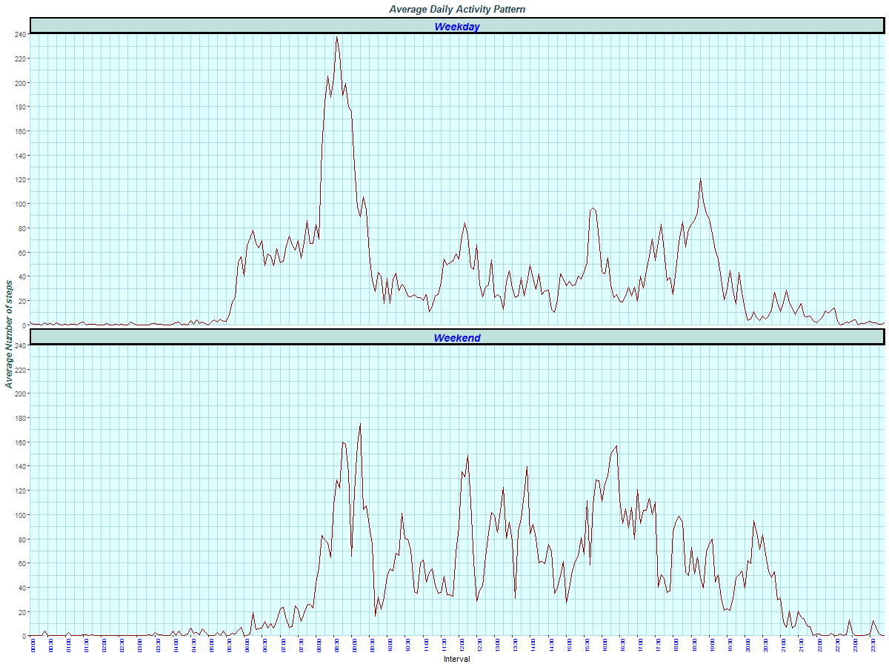

---
title: "Activity Analysis Report"
author: "Rahul Sankar Brahmachari"
date: "May 27, 2019"
output: 
  html_document:
    keep_md: true
--- 


## 1. Introduction

It is now possible to collect a large amount of data about personal movement using activity monitoring devices such as a [Fitbit](http://www.fitbit.com/), [Nike Fuelband](http://www.nike.com/us/en_us/c/nikeplus-fuelband), or [Jawbone Up](https://jawbone.com/up). These type of devices are part of the “quantified self” movement – a group of enthusiasts who take measurements about themselves regularly to improve their health, to find patterns in their behavior, or because they are tech geeks. But these data remain under-utilized both because the raw data are hard to obtain and there is a lack of statistical methods and software for processing and interpreting the data.

This analytic report uses a comma-separated-value (CSV) file with 17,568 observations from the course web site: [Activity monitoring data ](https://d396qusza40orc.cloudfront.net/repdata%2Fdata%2Factivity.zip) [52K] that consists of data representing the number of steps taken in 5 minute intervals each day from an anonymous individual collected using a personal activity monitoring device for two months during the months of October and November, 2012. 

The three variables included in this dataset are:

1. steps:    Number of steps taking in a 5-minute interval (missing values are coded as NA),
2. date:     The date on which the measurement was taken in YYYY-MM-DD format, and
3. interval: Identifier for the 5-minute interval in which measurement was taken.

This document, for peer assessments 1 of course "Reproducible Research" on coursera, presented as report along with the data and relevant code using R markdown that can be processed by knitr and be transformed into an HTML file. 

## 2. Data

We first check for the  comma-separated-value (CSV) file called "activity.csv" in the present working directory; and if the file is not present there then we download the Source data from the specified URL ("https://d396qusza40orc.cloudfront.net/repdata%2Fdata%2Factivity.zip") over the internet in a zipped archive format to the current working directory and unzip that to get our source data file "activity.csv". 

We then proceed to load the data from the file to a data frame "Source_Data" in computer memory and convert two columns - "date" and "interval" for enhanced readability. 


```r
if (!file.exists("./activity.csv")) {
      ## File is not present; so we download the Source data using URL
      ## URL for the Source Data
      fileUrl <- 
        "https://d396qusza40orc.cloudfront.net/repdata%2Fdata%2Factivity.zip"

      ## Download as "Activity.zip" on the current directory
      destfile = "./Activity.zip"

      ## Download and saved as "Activity.zip"" in the present working directory
      download.file(fileUrl, destfile)
      
      ## Unzip the downloaded Source Data
      unzip(destfile)
      
      ## Remove the zip archived file
      unlink(destfile)
      
}

## Load the Source Data from file to R data frame
Source_Data <- read.csv("./activity.csv")

## Convert columns to enhance readability
## date column using as.Date as the format is YYYY-MM-DD in the file
Source_Data$date <- as.Date(Source_Data$date)
## interval column as Hour:Minute 
Source_Data$interval <- format(strptime(sprintf("%04d", Source_Data$interval),                                                 format="%H%M"), 
                                        format = "%H:%M")
```

Here is a quick overview of the data: 

- There are a total ``17568`` rows and ``3``  columns: ``steps, date, interval``.

- ``288`` "5-Minute" intervals (``00:00`` - ``23:55``) per day. 

- ``61`` days spanning the months of October and November, 2012 (from ``Monday October 01, 2012`` to ``Friday November 30, 2012``).

- ``2304`` missing values for steps. 


```r
## Internal structure of our data frame:
  str(Source_Data)
```

```
'data.frame':	17568 obs. of  3 variables:
 $ steps   : int  NA NA NA NA NA NA NA NA NA NA ...
 $ date    : Date, format: "2012-10-01" "2012-10-01" ...
 $ interval: chr  "00:00" "00:05" "00:10" "00:15" ...
```

```r
## First 10 Rows: 
  head(Source_Data,10)
```

```
   steps       date interval
1     NA 2012-10-01    00:00
2     NA 2012-10-01    00:05
3     NA 2012-10-01    00:10
4     NA 2012-10-01    00:15
5     NA 2012-10-01    00:20
6     NA 2012-10-01    00:25
7     NA 2012-10-01    00:30
8     NA 2012-10-01    00:35
9     NA 2012-10-01    00:40
10    NA 2012-10-01    00:45
```

```r
## Last 10 Rows: 
  tail(Source_Data,10)
```

```
      steps       date interval
17559    NA 2012-11-30    23:10
17560    NA 2012-11-30    23:15
17561    NA 2012-11-30    23:20
17562    NA 2012-11-30    23:25
17563    NA 2012-11-30    23:30
17564    NA 2012-11-30    23:35
17565    NA 2012-11-30    23:40
17566    NA 2012-11-30    23:45
17567    NA 2012-11-30    23:50
17568    NA 2012-11-30    23:55
```

```r
## A Quick summary of our data frame:
  summary(Source_Data)
```

```
     steps             date              interval        
 Min.   :  0.00   Min.   :2012-10-01   Length:17568      
 1st Qu.:  0.00   1st Qu.:2012-10-16   Class :character  
 Median :  0.00   Median :2012-10-31   Mode  :character  
 Mean   : 37.38   Mean   :2012-10-31                     
 3rd Qu.: 12.00   3rd Qu.:2012-11-15                     
 Max.   :806.00   Max.   :2012-11-30                     
 NA's   :2304                                            
```


## 3. Data Analysis

Let us dive deep and started our analysis to answer a few questions:

### 3.1 What is mean total number of steps taken per day?

Let us calculate the total number of steps taken per day ignoring the missing values (Steps values represented by NA). We got 53 days of summarized data out of total 61 days that were present due to missing values in the dataset.


```r
## Summarized the data by date to find out the total number of steps taken per day
TSPD <- aggregate(steps ~ date,Source_Data, sum)
## Display the calculated total number of steps taken each day
TSPD
```

```
         date steps
1  2012-10-02   126
2  2012-10-03 11352
3  2012-10-04 12116
4  2012-10-05 13294
5  2012-10-06 15420
6  2012-10-07 11015
7  2012-10-09 12811
8  2012-10-10  9900
9  2012-10-11 10304
10 2012-10-12 17382
11 2012-10-13 12426
12 2012-10-14 15098
13 2012-10-15 10139
14 2012-10-16 15084
15 2012-10-17 13452
16 2012-10-18 10056
17 2012-10-19 11829
18 2012-10-20 10395
19 2012-10-21  8821
20 2012-10-22 13460
21 2012-10-23  8918
22 2012-10-24  8355
23 2012-10-25  2492
24 2012-10-26  6778
25 2012-10-27 10119
26 2012-10-28 11458
27 2012-10-29  5018
28 2012-10-30  9819
29 2012-10-31 15414
30 2012-11-02 10600
31 2012-11-03 10571
32 2012-11-05 10439
33 2012-11-06  8334
34 2012-11-07 12883
35 2012-11-08  3219
36 2012-11-11 12608
37 2012-11-12 10765
38 2012-11-13  7336
39 2012-11-15    41
40 2012-11-16  5441
41 2012-11-17 14339
42 2012-11-18 15110
43 2012-11-19  8841
44 2012-11-20  4472
45 2012-11-21 12787
46 2012-11-22 20427
47 2012-11-23 21194
48 2012-11-24 14478
49 2012-11-25 11834
50 2012-11-26 11162
51 2012-11-27 13646
52 2012-11-28 10183
53 2012-11-29  7047
```

Let us plot our finding with a histogram:


```r
## could have been better to turn off the echo for plots generations but kept ## it with echo on as advised for easier evaluation by peers.  
## Create the figure directory if not present to save or plots
if (!dir.exists("./figures")) {dir.create("./figures")}

## Save the plot as "PNG" file
png("./figures/plot1.png", width=600, height=480)

## put two histograms with frequency and distribution both
par(mfrow=c(1,2))
Plot_H <- hist(TSPD$steps,breaks=25,col="grey", ylim=range(pretty(c(0, 12))), xlim=range(pretty(c(min(TSPD$steps), max(TSPD$steps)))),xlab="Steps", main="Histogram:: Steps taken per Day")
text(Plot_H$mids,Plot_H$counts,labels=Plot_H$counts, adj=c(0.5, -0.5))
hist(TSPD$steps, breaks=25, freq=FALSE,  ylim=range(pretty(c(0, 0.00021))), xlim=range(pretty(c(min(TSPD$steps), max(TSPD$steps)))),xlab="Steps",  main="")
 curve(dnorm(x, mean=mean(TSPD$steps), sd=sd(TSPD$steps)), add=TRUE, col="red")
 abline(v = mean(TSPD$steps), col = "royalblue", lwd = 2)
legend(x = "topleft", # location of legend within plot area
 c("Density", "Mean"),  col = c("red", "royalblue"),lwd = c(2,2), box.lty=0)
dev.off()
```

<div class="figure">

<p class="caption">Fig. 1: Histogram ~ Steps taken per Day along with Mean and Density Distribution Curve</p>
</div>

***

We have calculated the mean (``10766.19`` ) and median (``10765`` ) of the total number of steps taken per day from our summarized data ignoring the missing values.

### 3.2 What is the average daily activity pattern?

Let us calculate the average number of steps taken on each "5-minute" interval across all the days again ignoring the missing values (Steps values represented by NA). We got 288 intervals of summarized data.


```r
## Summarized the data by intervals across all the days to find out the average number of steps taken in each "5-minute" interval
ASPI <- aggregate(steps ~ interval, Source_Data, mean)
## Display the calculated average number of steps taken on each 288 intervals across all the days
ASPI
```

```
    interval       steps
1      00:00   1.7169811
2      00:05   0.3396226
3      00:10   0.1320755
4      00:15   0.1509434
5      00:20   0.0754717
6      00:25   2.0943396
7      00:30   0.5283019
8      00:35   0.8679245
9      00:40   0.0000000
10     00:45   1.4716981
11     00:50   0.3018868
12     00:55   0.1320755
13     01:00   0.3207547
14     01:05   0.6792453
15     01:10   0.1509434
16     01:15   0.3396226
17     01:20   0.0000000
18     01:25   1.1132075
19     01:30   1.8301887
20     01:35   0.1698113
21     01:40   0.1698113
22     01:45   0.3773585
23     01:50   0.2641509
24     01:55   0.0000000
25     02:00   0.0000000
26     02:05   0.0000000
27     02:10   1.1320755
28     02:15   0.0000000
29     02:20   0.0000000
30     02:25   0.1320755
31     02:30   0.0000000
32     02:35   0.2264151
33     02:40   0.0000000
34     02:45   0.0000000
35     02:50   1.5471698
36     02:55   0.9433962
37     03:00   0.0000000
38     03:05   0.0000000
39     03:10   0.0000000
40     03:15   0.0000000
41     03:20   0.2075472
42     03:25   0.6226415
43     03:30   1.6226415
44     03:35   0.5849057
45     03:40   0.4905660
46     03:45   0.0754717
47     03:50   0.0000000
48     03:55   0.0000000
49     04:00   1.1886792
50     04:05   0.9433962
51     04:10   2.5660377
52     04:15   0.0000000
53     04:20   0.3396226
54     04:25   0.3584906
55     04:30   4.1132075
56     04:35   0.6603774
57     04:40   3.4905660
58     04:45   0.8301887
59     04:50   3.1132075
60     04:55   1.1132075
61     05:00   0.0000000
62     05:05   1.5660377
63     05:10   3.0000000
64     05:15   2.2452830
65     05:20   3.3207547
66     05:25   2.9622642
67     05:30   2.0943396
68     05:35   6.0566038
69     05:40  16.0188679
70     05:45  18.3396226
71     05:50  39.4528302
72     05:55  44.4905660
73     06:00  31.4905660
74     06:05  49.2641509
75     06:10  53.7735849
76     06:15  63.4528302
77     06:20  49.9622642
78     06:25  47.0754717
79     06:30  52.1509434
80     06:35  39.3396226
81     06:40  44.0188679
82     06:45  44.1698113
83     06:50  37.3584906
84     06:55  49.0377358
85     07:00  43.8113208
86     07:05  44.3773585
87     07:10  50.5094340
88     07:15  54.5094340
89     07:20  49.9245283
90     07:25  50.9811321
91     07:30  55.6792453
92     07:35  44.3207547
93     07:40  52.2641509
94     07:45  69.5471698
95     07:50  57.8490566
96     07:55  56.1509434
97     08:00  73.3773585
98     08:05  68.2075472
99     08:10 129.4339623
100    08:15 157.5283019
101    08:20 171.1509434
102    08:25 155.3962264
103    08:30 177.3018868
104    08:35 206.1698113
105    08:40 195.9245283
106    08:45 179.5660377
107    08:50 183.3962264
108    08:55 167.0188679
109    09:00 143.4528302
110    09:05 124.0377358
111    09:10 109.1132075
112    09:15 108.1132075
113    09:20 103.7169811
114    09:25  95.9622642
115    09:30  66.2075472
116    09:35  45.2264151
117    09:40  24.7924528
118    09:45  38.7547170
119    09:50  34.9811321
120    09:55  21.0566038
121    10:00  40.5660377
122    10:05  26.9811321
123    10:10  42.4150943
124    10:15  52.6603774
125    10:20  38.9245283
126    10:25  50.7924528
127    10:30  44.2830189
128    10:35  37.4150943
129    10:40  34.6981132
130    10:45  28.3396226
131    10:50  25.0943396
132    10:55  31.9433962
133    11:00  31.3584906
134    11:05  29.6792453
135    11:10  21.3207547
136    11:15  25.5471698
137    11:20  28.3773585
138    11:25  26.4716981
139    11:30  33.4339623
140    11:35  49.9811321
141    11:40  42.0377358
142    11:45  44.6037736
143    11:50  46.0377358
144    11:55  59.1886792
145    12:00  63.8679245
146    12:05  87.6981132
147    12:10  94.8490566
148    12:15  92.7735849
149    12:20  63.3962264
150    12:25  50.1698113
151    12:30  54.4716981
152    12:35  32.4150943
153    12:40  26.5283019
154    12:45  37.7358491
155    12:50  45.0566038
156    12:55  67.2830189
157    13:00  42.3396226
158    13:05  39.8867925
159    13:10  43.2641509
160    13:15  40.9811321
161    13:20  46.2452830
162    13:25  56.4339623
163    13:30  42.7547170
164    13:35  25.1320755
165    13:40  39.9622642
166    13:45  53.5471698
167    13:50  47.3207547
168    13:55  60.8113208
169    14:00  55.7547170
170    14:05  51.9622642
171    14:10  43.5849057
172    14:15  48.6981132
173    14:20  35.4716981
174    14:25  37.5471698
175    14:30  41.8490566
176    14:35  27.5094340
177    14:40  17.1132075
178    14:45  26.0754717
179    14:50  43.6226415
180    14:55  43.7735849
181    15:00  30.0188679
182    15:05  36.0754717
183    15:10  35.4905660
184    15:15  38.8490566
185    15:20  45.9622642
186    15:25  47.7547170
187    15:30  48.1320755
188    15:35  65.3207547
189    15:40  82.9056604
190    15:45  98.6603774
191    15:50 102.1132075
192    15:55  83.9622642
193    16:00  62.1320755
194    16:05  64.1320755
195    16:10  74.5471698
196    16:15  63.1698113
197    16:20  56.9056604
198    16:25  59.7735849
199    16:30  43.8679245
200    16:35  38.5660377
201    16:40  44.6603774
202    16:45  45.4528302
203    16:50  46.2075472
204    16:55  43.6792453
205    17:00  46.6226415
206    17:05  56.3018868
207    17:10  50.7169811
208    17:15  61.2264151
209    17:20  72.7169811
210    17:25  78.9433962
211    17:30  68.9433962
212    17:35  59.6603774
213    17:40  75.0943396
214    17:45  56.5094340
215    17:50  34.7735849
216    17:55  37.4528302
217    18:00  40.6792453
218    18:05  58.0188679
219    18:10  74.6981132
220    18:15  85.3207547
221    18:20  59.2641509
222    18:25  67.7735849
223    18:30  77.6981132
224    18:35  74.2452830
225    18:40  85.3396226
226    18:45  99.4528302
227    18:50  86.5849057
228    18:55  85.6037736
229    19:00  84.8679245
230    19:05  77.8301887
231    19:10  58.0377358
232    19:15  53.3584906
233    19:20  36.3207547
234    19:25  20.7169811
235    19:30  27.3962264
236    19:35  40.0188679
237    19:40  30.2075472
238    19:45  25.5471698
239    19:50  45.6603774
240    19:55  33.5283019
241    20:00  19.6226415
242    20:05  19.0188679
243    20:10  19.3396226
244    20:15  33.3396226
245    20:20  26.8113208
246    20:25  21.1698113
247    20:30  27.3018868
248    20:35  21.3396226
249    20:40  19.5471698
250    20:45  21.3207547
251    20:50  32.3018868
252    20:55  20.1509434
253    21:00  15.9433962
254    21:05  17.2264151
255    21:10  23.4528302
256    21:15  19.2452830
257    21:20  12.4528302
258    21:25   8.0188679
259    21:30  14.6603774
260    21:35  16.3018868
261    21:40   8.6792453
262    21:45   7.7924528
263    21:50   8.1320755
264    21:55   2.6226415
265    22:00   1.4528302
266    22:05   3.6792453
267    22:10   4.8113208
268    22:15   8.5094340
269    22:20   7.0754717
270    22:25   8.6981132
271    22:30   9.7547170
272    22:35   2.2075472
273    22:40   0.3207547
274    22:45   0.1132075
275    22:50   1.6037736
276    22:55   4.6037736
277    23:00   3.3018868
278    23:05   2.8490566
279    23:10   0.0000000
280    23:15   0.8301887
281    23:20   0.9622642
282    23:25   1.5849057
283    23:30   2.6037736
284    23:35   4.6981132
285    23:40   3.3018868
286    23:45   0.6415094
287    23:50   0.2264151
288    23:55   1.0754717
```

Let us put our finding with a time series plot (i.e. type="l") of the 5-minute interval on x-axis and the average number of steps taken, averaged across all days on y-axis:


```r
## If 'ggplot2' package is not available, then install it
   if (!require(ggplot2)) {install.packages('ggplot2')}
        
  ## Load package ggplot2
    library(ggplot2)

## If 'scales' package is not available, then install it
   if (!require(scales)) {install.packages('scales')}
        
  ## Load package scales for X-Axis ticks 
    library(scales)

## Save the plot as "PNG" file
png("./figures/plot2.png", width=1200, height=480)

YMax <- round(max(ASPI$steps)+5,-1)
ggplot(ASPI, 
   aes(x=as.POSIXct(ASPI$interval, format="%H:%M", tz="UTC"), y=steps)
) +
scale_x_datetime(date_breaks = "10 min", labels = date_format("%H:%M"),
                    expand = c(0,0)) +
scale_y_continuous(breaks = seq(0,YMax,5), limits = c(0,YMax),
                      expand = c(0, 0))+  
geom_line(color="darkred")+
labs(title="Average Daily Activity Pattern", x="Interval", 
        y="Average Number of steps") +  
theme(
  panel.background=element_rect(fill= "lightcyan", colour = "lightcyan", 
                                size = 0.5, linetype = "solid"),
  plot.title = element_text(colour="#1E434C", face = "bold.italic", 
                            hjust = 0.5),
  axis.text.x = element_text(angle = 90, vjust = 1.0, hjust = 1.0,
                             size=7,colour ="blue"),
  axis.title.y = element_text(color="#34675C", face="bold.italic", size=12),
  panel.grid = element_line( linetype = 'solid', colour="lightblue")
)

dev.off()
```


<div class="figure">

<p class="caption">Fig. 2: TimeSeries ~ Average Daily Activity</p>
</div>

***

We also find out that the 5-minute interval starting at ``08:35``, on average across all the days in the dataset, contains the maximum number of steps(``206.1698113`` steps). 


### 3.3 Imputing missing values

Missing data (or missing values) is defined as the data value that is not stored for a variable in the observation of interest. Missing data present various problems. First, the absence of data can cause bias in the estimation of parameters. Second, it can reduce the representativeness of the samples. Third,  the lost data reduces statistical power, which refers to the probability that the test will reject the null hypothesis when it is false. These distortions arises out of the missing data not only complicate the analysis but may even threaten the validity of the conclusions.

There are ``2304`` missing values (coded as NA) for "steps" in our source data.

Before devising a strategy for filling in all of the missing values in the dataset, a closer look reveals two outliers:

1. date "2012-10-02" which has only two intervals with non-zero data summing up of a total of 126 steps for the whole day; and 

2. date "2012-11-15" which also has only two intervals with non-zero data summing up of a total of only 41 steps for the whole day


```r
## date "2012-10-02" which has only two intervals with non-zero data summing up of a total of 126 steps for the whole day 
TSPD[TSPD$date=='2012-10-02',]
```

```
        date steps
1 2012-10-02   126
```

```r
Source_Data[Source_Data$date=='2012-10-02' & Source_Data$steps != 0 ,]
```

```
    steps       date interval
555   117 2012-10-02    22:10
556     9 2012-10-02    22:15
```

```r
##date "2012-11-15" which also has only two intervals with non-zero data summing up of a total of only 41 steps for the whole day
TSPD[TSPD$date=='2012-11-15',]
```

```
         date steps
39 2012-11-15    41
```

```r
Source_Data[Source_Data$date=='2012-11-15' & Source_Data$steps != 0 ,]
```

```
      steps       date interval
13002    33 2012-11-15    03:25
13003     8 2012-11-15    03:30
```

As this assignment does not demand too sophisticated a strategy to fill the missing values; we have not delved much time to analyze the nature of the missing values i.e. whether they are missing completely at random (MCAR), missing at random (MAR), or missing not at random (MNAR), etc.  

However, for our imputation, we would like to exclude two special days highlighted above, while calculating the mean value for steps per interval for that specific day of the week. Although we could ignore the date ``Tuesday October 02, 2012`` as there is no missing value  for any Tuesday in the dataset so neither the inclusion nor the exclusion will have any material impact on our imputation strategy.

Below  is the code snippet used to generate the missing values with the strategy outlined above:


```r
## If 'dplyr' package is not available, then install it

suppressWarnings(suppressMessages(suppressPackageStartupMessages(
  if (!require(dplyr)) {install.packages('dplyr')}
)))
        
## Load package dplyr
  library(dplyr)

Altered_Data <- Source_Data %>%
 mutate(Day=weekdays(date)) %>% ## Adding a new column for calculation    
 group_by(interval,Day)        

## Filled the missing values with mean for the interval of that day of the week 
Altered_Data[Altered_Data$date != '2012-11-15'& 
             Altered_Data$date != '2012-10-02',]  <- Altered_Data[Altered_Data$date != '2012-11-15'& 
             Altered_Data$date != '2012-10-02',] %>% 
mutate_at(vars(steps), list(~ifelse(is.na(.), mean(., na.rm = TRUE),.)))


## Creating a new dataset that is equal to the original dataset but with the missing data filled in

Filled_Data <- Altered_Data [names(Source_Data)]


## Taking an overview on the new dataset with str () & summary()
str(Filled_Data)
```

```
Classes 'tbl_df', 'tbl' and 'data.frame':	17568 obs. of  3 variables:
 $ steps   : num  1.43 0 0 0 0 ...
 $ date    : Date, format: "2012-10-01" "2012-10-01" ...
 $ interval: chr  "00:00" "00:05" "00:10" "00:15" ...
```

```r
summary(Filled_Data)
```

```
     steps             date              interval        
 Min.   :  0.00   Min.   :2012-10-01   Length:17568      
 1st Qu.:  0.00   1st Qu.:2012-10-16   Class :character  
 Median :  0.00   Median :2012-10-31   Mode  :character  
 Mean   : 37.64   Mean   :2012-10-31                     
 3rd Qu.: 19.40   3rd Qu.:2012-11-15                     
 Max.   :806.00   Max.   :2012-11-30                     
```

```r
## Save the new dataset to a new comma-separated-value (CSV) file for future use.
write.csv(Filled_Data, file = "./Activity_filled.csv", row.names = FALSE, quote=TRUE)
```

Let us calculate the total number of steps taken per day with this newly create dataset that has no missing value. 


```r
## Summarized the data by date to find out the total number of steps taken per day
TSPDN <- aggregate(steps ~ date,Filled_Data, sum)
## Display the calculated total number of steps taken each day
TSPDN
```

```
         date     steps
1  2012-10-01  9974.857
2  2012-10-02   126.000
3  2012-10-03 11352.000
4  2012-10-04 12116.000
5  2012-10-05 13294.000
6  2012-10-06 15420.000
7  2012-10-07 11015.000
8  2012-10-08  9974.857
9  2012-10-09 12811.000
10 2012-10-10  9900.000
11 2012-10-11 10304.000
12 2012-10-12 17382.000
13 2012-10-13 12426.000
14 2012-10-14 15098.000
15 2012-10-15 10139.000
16 2012-10-16 15084.000
17 2012-10-17 13452.000
18 2012-10-18 10056.000
19 2012-10-19 11829.000
20 2012-10-20 10395.000
21 2012-10-21  8821.000
22 2012-10-22 13460.000
23 2012-10-23  8918.000
24 2012-10-24  8355.000
25 2012-10-25  2492.000
26 2012-10-26  6778.000
27 2012-10-27 10119.000
28 2012-10-28 11458.000
29 2012-10-29  5018.000
30 2012-10-30  9819.000
31 2012-10-31 15414.000
32 2012-11-01  9380.143
33 2012-11-02 10600.000
34 2012-11-03 10571.000
35 2012-11-04 12277.714
36 2012-11-05 10439.000
37 2012-11-06  8334.000
38 2012-11-07 12883.000
39 2012-11-08  3219.000
40 2012-11-09 12359.714
41 2012-11-10 12535.429
42 2012-11-11 12608.000
43 2012-11-12 10765.000
44 2012-11-13  7336.000
45 2012-11-14 11790.750
46 2012-11-15    41.000
47 2012-11-16  5441.000
48 2012-11-17 14339.000
49 2012-11-18 15110.000
50 2012-11-19  8841.000
51 2012-11-20  4472.000
52 2012-11-21 12787.000
53 2012-11-22 20427.000
54 2012-11-23 21194.000
55 2012-11-24 14478.000
56 2012-11-25 11834.000
57 2012-11-26 11162.000
58 2012-11-27 13646.000
59 2012-11-28 10183.000
60 2012-11-29  7047.000
61 2012-11-30 12359.714
```

Let us again plot our finding with a histogram:


```r
## Save the plot as "PNG" file
png("./figures/plot3.png", width=600, height=480)

## put two histograms with frequency and distribution both
par(mfrow=c(1,2))
Plot_H <- hist(TSPDN$steps,breaks=25,col="grey", ylim=range(pretty(c(0, 12))), xlim=range(pretty(c(min(TSPDN$steps), max(TSPDN$steps)))),xlab="Steps", main="Histogram:: Steps taken per Day")
text(Plot_H$mids,Plot_H$counts,labels=Plot_H$counts, adj=c(0.5, -0.5))
hist(TSPDN$steps, breaks=25, freq=FALSE,  ylim=range(pretty(c(0, 0.00021))), xlim=range(pretty(c(min(TSPDN$steps), max(TSPDN$steps)))),xlab="Steps",  main="")
 curve(dnorm(x, mean=mean(TSPDN$steps), sd=sd(TSPDN$steps)), add=TRUE, col="red")
 abline(v = mean(TSPDN$steps), col = "royalblue", lwd = 2)
 legend(x = "topleft", # location of legend within plot area
  c("Density", "Mean"),  col = c("red", "royalblue"),lwd = c(2,2), box.lty=0)
 
 dev.off()
```

<div class="figure">

<p class="caption">Fig. 3: Histogram ~ Steps taken per Day along with Mean and Density Distribution Curve</p>
</div>

***

We have calculated the mean (``10840.35`` ) and median (``11015`` ) of the total number of steps taken per day from our summarized data with the newly created dataset that has been augmented by imputing the missing values in source dataset.

Yes there are changes in the estimates along the expected line -  while the mean and median increase, but the standard deviation decreases. 


```r
## Mean & Median of the total number of steps taken per day
TBL <- data.frame(Dataset = c("Source Data with 2304 Missing Values","Filled Data wth no Missing Values","Statistical Impact on value imputation (%)"), Mean=c(format(mean(TSPD$steps),scientific=FALSE),format(mean(TSPDN$steps),scientific=FALSE),format((mean(TSPDN$steps)/mean(TSPD$steps) - 1)*100,scientific=FALSE)), 
Median=c(format(median(TSPD$steps),scientific=FALSE),format(median(TSPDN$steps),scientific=FALSE),format((median(TSPDN$steps)/median(TSPD$steps) - 1)*100,scientific=FALSE)), 
StdDev=c(format(sd(TSPD$steps),scientific=FALSE),format(sd(TSPDN$steps),scientific=FALSE),format((sd(TSPDN$steps)/sd(TSPD$steps) - 1)*100,scientific=FALSE)) )


## If 'kableExtra' package is not available, then install it
suppressWarnings(suppressMessages(suppressPackageStartupMessages(
  if (!require(kableExtra)) {install.packages('kableExtra')}
)))

## Load package kableExtra
  library(kableExtra)
kable(TBL) %>%
  kable_styling(bootstrap_options = c("striped", "hover", "condensed"),                        full_width = F)
```

<table class="table table-striped table-hover table-condensed" style="width: auto !important; margin-left: auto; margin-right: auto;">
 <thead>
  <tr>
   <th style="text-align:left;"> Dataset </th>
   <th style="text-align:left;"> Mean </th>
   <th style="text-align:left;"> Median </th>
   <th style="text-align:left;"> StdDev </th>
  </tr>
 </thead>
<tbody>
  <tr>
   <td style="text-align:left;"> Source Data with 2304 Missing Values </td>
   <td style="text-align:left;"> 10766.19 </td>
   <td style="text-align:left;"> 10765 </td>
   <td style="text-align:left;"> 4269.18 </td>
  </tr>
  <tr>
   <td style="text-align:left;"> Filled Data wth no Missing Values </td>
   <td style="text-align:left;"> 10840.35 </td>
   <td style="text-align:left;"> 11015 </td>
   <td style="text-align:left;"> 4004.431 </td>
  </tr>
  <tr>
   <td style="text-align:left;"> Statistical Impact on value imputation (%) </td>
   <td style="text-align:left;"> 0.6888093 </td>
   <td style="text-align:left;"> 2.322341 </td>
   <td style="text-align:left;"> -6.201402 </td>
  </tr>
</tbody>
</table>

### 3.4 Are there differences in activity patterns between weekdays and weekends?

In Order to answer this we introduce a new column called Type to classify the date as weekdays or weekends in the newly created Filled_Data by using the format option with %u; and then calculate the average number of steps taken on each "5-minute" interval across all weekday days or weekend days.


```r
## Add a new column to classify the dates in Weekdays and weekends
Filled_Data <- Filled_Data %>% mutate(Type=ifelse(format
(Filled_Data$date,"%u") %in% c(6,7),"Weekend","Weekday"))

## Summarized the data by intervals across the type of days (weekday or weekend) to find out the average number of steps taken in each "5-minute" interval
ASPIN <- aggregate(steps ~ interval+Type, Filled_Data, mean)
## Display the calculated average number of steps taken on each 288 intervals across all weekday days or weekend days
ASPIN
```

```
    interval    Type        steps
1      00:00 Weekday   2.32936508
2      00:05 Weekday   0.45000000
3      00:10 Weekday   0.17500000
4      00:15 Weekday   0.20317460
5      00:20 Weekday   0.08888889
6      00:25 Weekday   1.56825397
7      00:30 Weekday   0.62222222
8      00:35 Weekday   1.16825397
9      00:40 Weekday   0.00000000
10     00:45 Weekday   1.80000000
11     00:50 Weekday   0.42857143
12     00:55 Weekday   0.00000000
13     01:00 Weekday   0.42500000
14     01:05 Weekday   0.00000000
15     01:10 Weekday   0.20317460
16     01:15 Weekday   0.51428571
17     01:20 Weekday   0.00000000
18     01:25 Weekday   1.49841270
19     01:30 Weekday   2.38095238
20     01:35 Weekday   0.00000000
21     01:40 Weekday   0.20000000
22     01:45 Weekday   0.25714286
23     01:50 Weekday   0.40000000
24     01:55 Weekday   0.00000000
25     02:00 Weekday   0.00000000
26     02:05 Weekday   0.00000000
27     02:10 Weekday   1.24444444
28     02:15 Weekday   0.00000000
29     02:20 Weekday   0.00000000
30     02:25 Weekday   0.20000000
31     02:30 Weekday   0.00000000
32     02:35 Weekday   0.26666667
33     02:40 Weekday   0.00000000
34     02:45 Weekday   0.00000000
35     02:50 Weekday   2.27936508
36     02:55 Weekday   1.11111111
37     03:00 Weekday   0.00000000
38     03:05 Weekday   0.00000000
39     03:10 Weekday   0.00000000
40     03:15 Weekday   0.00000000
41     03:20 Weekday   0.00000000
42     03:25 Weekday   0.73333333
43     03:30 Weekday   1.26349206
44     03:35 Weekday   0.50476190
45     03:40 Weekday   0.45714286
46     03:45 Weekday   0.10000000
47     03:50 Weekday   0.00000000
48     03:55 Weekday   0.00000000
49     04:00 Weekday   0.12500000
50     04:05 Weekday   1.42857143
51     04:10 Weekday   2.05238095
52     04:15 Weekday   0.00000000
53     04:20 Weekday   0.48571429
54     04:25 Weekday   0.00000000
55     04:30 Weekday   3.34642857
56     04:35 Weekday   0.17142857
57     04:40 Weekday   3.81587302
58     04:45 Weekday   0.95238095
59     04:50 Weekday   2.26984127
60     04:55 Weekday   0.74285714
61     05:00 Weekday   0.00000000
62     05:05 Weekday   2.21785714
63     05:10 Weekday   4.30515873
64     05:15 Weekday   2.37142857
65     05:20 Weekday   4.67619048
66     05:25 Weekday   2.61904762
67     05:30 Weekday   2.77142857
68     05:35 Weekday   7.62063492
69     05:40 Weekday  18.69246032
70     05:45 Weekday  22.29325397
71     05:50 Weekday  51.02460317
72     05:55 Weekday  55.99722222
73     06:00 Weekday  40.35357143
74     06:05 Weekday  65.41547619
75     06:10 Weekday  71.21111111
76     06:15 Weekday  77.91666667
77     06:20 Weekday  66.98055556
78     06:25 Weekday  63.11587302
79     06:30 Weekday  69.21031746
80     06:35 Weekday  48.92301587
81     06:40 Weekday  58.73492063
82     06:45 Weekday  56.87738095
83     06:50 Weekday  48.47976190
84     06:55 Weekday  62.98968254
85     07:00 Weekday  50.92698413
86     07:05 Weekday  52.44166667
87     07:10 Weekday  65.46785714
88     07:15 Weekday  73.24603175
89     07:20 Weekday  65.70793651
90     07:25 Weekday  61.55357143
91     07:30 Weekday  69.25317460
92     07:35 Weekday  54.84682540
93     07:40 Weekday  67.52142857
94     07:45 Weekday  85.85634921
95     07:50 Weekday  67.12023810
96     07:55 Weekday  66.91706349
97     08:00 Weekday  83.00912698
98     08:05 Weekday  70.64642857
99     08:10 Weekday 145.15277778
100    08:15 Weekday 183.52539683
101    08:20 Weekday 205.41904762
102    08:25 Weekday 187.75555556
103    08:30 Weekday 203.36666667
104    08:35 Weekday 237.80317460
105    08:40 Weekday 223.42222222
106    08:45 Weekday 188.52896825
107    08:50 Weekday 198.95396825
108    08:55 Weekday 179.34206349
109    09:00 Weekday 175.88730159
110    09:05 Weekday 130.50158730
111    09:10 Weekday  96.77142857
112    09:15 Weekday  88.81428571
113    09:20 Weekday 105.60873016
114    09:25 Weekday  94.60992063
115    09:30 Weekday  58.74920635
116    09:35 Weekday  36.28253968
117    09:40 Weekday  27.19603175
118    09:45 Weekday  42.92976190
119    09:50 Weekday  40.34444444
120    09:55 Weekday  17.66071429
121    10:00 Weekday  38.06111111
122    10:05 Weekday  17.80357143
123    10:10 Weekday  37.01626984
124    10:15 Weekday  42.69206349
125    10:20 Weekday  27.95039683
126    10:25 Weekday  33.19880952
127    10:30 Weekday  30.45396825
128    10:35 Weekday  23.76428571
129    10:40 Weekday  22.91388889
130    10:45 Weekday  24.60198413
131    10:50 Weekday  22.71865079
132    10:55 Weekday  22.25595238
133    11:00 Weekday  20.11071429
134    11:05 Weekday  25.06666667
135    11:10 Weekday  10.97420635
136    11:15 Weekday  14.83849206
137    11:20 Weekday  23.92936508
138    11:25 Weekday  24.73015873
139    11:30 Weekday  35.11349206
140    11:35 Weekday  54.08849206
141    11:40 Weekday  49.35158730
142    11:45 Weekday  50.91428571
143    11:50 Weekday  52.51031746
144    11:55 Weekday  58.35079365
145    12:00 Weekday  54.43333333
146    12:05 Weekday  73.43452381
147    12:10 Weekday  84.10793651
148    12:15 Weekday  73.89523810
149    12:20 Weekday  47.23888889
150    12:25 Weekday  45.71587302
151    12:30 Weekday  65.57063492
152    12:35 Weekday  33.14007937
153    12:40 Weekday  23.09841270
154    12:45 Weekday  31.17142857
155    12:50 Weekday  32.68134921
156    12:55 Weekday  53.42142857
157    13:00 Weekday  22.27222222
158    13:05 Weekday  24.96507937
159    13:10 Weekday  22.82777778
160    13:15 Weekday  12.85436508
161    13:20 Weekday  35.53650794
162    13:25 Weekday  44.63214286
163    13:30 Weekday  30.09285714
164    13:35 Weekday  22.21150794
165    13:40 Weekday  23.72023810
166    13:45 Weekday  38.87500000
167    13:50 Weekday  23.47142857
168    13:55 Weekday  35.17222222
169    14:00 Weekday  49.26388889
170    14:05 Weekday  38.61230159
171    14:10 Weekday  29.39444444
172    14:15 Weekday  42.10833333
173    14:20 Weekday  25.01785714
174    14:25 Weekday  27.62936508
175    14:30 Weekday  28.44603175
176    14:35 Weekday  12.72817460
177    14:40 Weekday  10.27103175
178    14:45 Weekday  20.71944444
179    14:50 Weekday  42.06547619
180    14:55 Weekday  37.58293651
181    15:00 Weekday  32.37738095
182    15:05 Weekday  35.92936508
183    15:10 Weekday  31.99246032
184    15:15 Weekday  32.61785714
185    15:20 Weekday  40.16309524
186    15:25 Weekday  37.40714286
187    15:30 Weekday  43.91428571
188    15:35 Weekday  51.11468254
189    15:40 Weekday  94.10674603
190    15:45 Weekday  96.51666667
191    15:50 Weekday  93.75515873
192    15:55 Weekday  70.57142857
193    16:00 Weekday  43.86071429
194    16:05 Weekday  41.86507937
195    16:10 Weekday  55.69682540
196    16:15 Weekday  32.93015873
197    16:20 Weekday  22.31230159
198    16:25 Weekday  25.10476190
199    16:30 Weekday  19.35436508
200    16:35 Weekday  18.85992063
201    16:40 Weekday  23.55753968
202    16:45 Weekday  31.26984127
203    16:50 Weekday  23.60317460
204    16:55 Weekday  30.70555556
205    17:00 Weekday  19.06666667
206    17:05 Weekday  39.91111111
207    17:10 Weekday  30.10238095
208    17:15 Weekday  44.60119048
209    17:20 Weekday  56.54365079
210    17:25 Weekday  70.85674603
211    17:30 Weekday  53.10119048
212    17:35 Weekday  67.87182540
213    17:40 Weekday  83.00238095
214    17:45 Weekday  60.94246032
215    17:50 Weekday  36.45000000
216    17:55 Weekday  39.00595238
217    18:00 Weekday  24.85793651
218    18:05 Weekday  45.85079365
219    18:10 Weekday  68.18134921
220    18:15 Weekday  84.67341270
221    18:20 Weekday  64.13650794
222    18:25 Weekday  78.70317460
223    18:30 Weekday  82.79047619
224    18:35 Weekday  85.90912698
225    18:40 Weekday  92.85357143
226    18:45 Weekday 120.72063492
227    18:50 Weekday 102.17698413
228    18:55 Weekday  91.50000000
229    19:00 Weekday  87.04166667
230    19:05 Weekday  74.74166667
231    19:10 Weekday  61.39603175
232    19:15 Weekday  53.97182540
233    19:20 Weekday  37.67539683
234    19:25 Weekday  20.30714286
235    19:30 Weekday  29.09642857
236    19:35 Weekday  45.29682540
237    19:40 Weekday  28.20634921
238    19:45 Weekday  16.87063492
239    19:50 Weekday  43.01190476
240    19:55 Weekday  25.97817460
241    20:00 Weekday  13.02619048
242    20:05 Weekday   3.61904762
243    20:10 Weekday   4.68571429
244    20:15 Weekday  11.04206349
245    20:20 Weekday   5.89087302
246    20:25 Weekday   3.44880952
247    20:30 Weekday   7.26269841
248    20:35 Weekday   4.83769841
249    20:40 Weekday   7.10317460
250    20:45 Weekday  12.43412698
251    20:50 Weekday  26.47182540
252    20:55 Weekday  18.43809524
253    21:00 Weekday  10.75873016
254    21:05 Weekday  18.23095238
255    21:10 Weekday  28.61785714
256    21:15 Weekday  18.63095238
257    21:20 Weekday  14.16547619
258    21:25 Weekday   8.35555556
259    21:30 Weekday  12.96865079
260    21:35 Weekday  17.29523810
261    21:40 Weekday   7.06746032
262    21:45 Weekday   6.60000000
263    21:50 Weekday   7.42539683
264    21:55 Weekday   3.58095238
265    22:00 Weekday   1.55555556
266    22:05 Weekday   4.24444444
267    22:10 Weekday   6.41269841
268    22:15 Weekday  11.59365079
269    22:20 Weekday   9.74087302
270    22:25 Weekday  12.32539683
271    22:30 Weekday  14.09841270
272    22:35 Weekday   2.99365079
273    22:40 Weekday   0.00000000
274    22:45 Weekday   0.17142857
275    22:50 Weekday   2.17142857
276    22:55 Weekday   1.80000000
277    23:00 Weekday   3.26071429
278    23:05 Weekday   3.77777778
279    23:10 Weekday   0.00000000
280    23:15 Weekday   1.10952381
281    23:20 Weekday   1.29523810
282    23:25 Weekday   1.76349206
283    23:30 Weekday   2.76388889
284    23:35 Weekday   1.69722222
285    23:40 Weekday   1.85396825
286    23:45 Weekday   0.20000000
287    23:50 Weekday   0.30158730
288    23:55 Weekday   1.39801587
289    00:00 Weekend   0.00000000
290    00:05 Weekend   0.00000000
291    00:10 Weekend   0.00000000
292    00:15 Weekend   0.00000000
293    00:20 Weekend   0.00000000
294    00:25 Weekend   3.71428571
295    00:30 Weekend   0.00000000
296    00:35 Weekend   0.00000000
297    00:40 Weekend   0.00000000
298    00:45 Weekend   0.42857143
299    00:50 Weekend   0.00000000
300    00:55 Weekend   0.50000000
301    01:00 Weekend   0.00000000
302    01:05 Weekend   2.57142857
303    01:10 Weekend   0.00000000
304    01:15 Weekend   0.00000000
305    01:20 Weekend   0.00000000
306    01:25 Weekend   0.00000000
307    01:30 Weekend   0.57142857
308    01:35 Weekend   0.64285714
309    01:40 Weekend   0.00000000
310    01:45 Weekend   0.78571429
311    01:50 Weekend   0.00000000
312    01:55 Weekend   0.00000000
313    02:00 Weekend   0.00000000
314    02:05 Weekend   0.00000000
315    02:10 Weekend   0.28571429
316    02:15 Weekend   0.00000000
317    02:20 Weekend   0.00000000
318    02:25 Weekend   0.00000000
319    02:30 Weekend   0.00000000
320    02:35 Weekend   0.00000000
321    02:40 Weekend   0.00000000
322    02:45 Weekend   0.00000000
323    02:50 Weekend   0.00000000
324    02:55 Weekend   0.00000000
325    03:00 Weekend   0.00000000
326    03:05 Weekend   0.00000000
327    03:10 Weekend   0.00000000
328    03:15 Weekend   0.00000000
329    03:20 Weekend   0.78571429
330    03:25 Weekend   0.00000000
331    03:30 Weekend   2.85714286
332    03:35 Weekend   0.78571429
333    03:40 Weekend   0.71428571
334    03:45 Weekend   0.00000000
335    03:50 Weekend   0.00000000
336    03:55 Weekend   0.00000000
337    04:00 Weekend   4.14285714
338    04:05 Weekend   0.00000000
339    04:10 Weekend   3.64285714
340    04:15 Weekend   0.00000000
341    04:20 Weekend   0.00000000
342    04:25 Weekend   1.35714286
343    04:30 Weekend   6.50000000
344    04:35 Weekend   2.07142857
345    04:40 Weekend   2.57142857
346    04:45 Weekend   0.64285714
347    04:50 Weekend   5.57142857
348    04:55 Weekend   2.35714286
349    05:00 Weekend   0.00000000
350    05:05 Weekend   0.00000000
351    05:10 Weekend   0.00000000
352    05:15 Weekend   2.42857143
353    05:20 Weekend   0.42857143
354    05:25 Weekend   3.78571429
355    05:30 Weekend   0.00000000
356    05:35 Weekend   0.00000000
357    05:40 Weekend   1.92857143
358    05:45 Weekend   1.28571429
359    05:50 Weekend   4.42857143
360    05:55 Weekend   6.64285714
361    06:00 Weekend   0.00000000
362    06:05 Weekend   0.00000000
363    06:10 Weekend   1.35714286
364    06:15 Weekend  19.42857143
365    06:20 Weekend   5.07142857
366    06:25 Weekend   5.42857143
367    06:30 Weekend   6.21428571
368    06:35 Weekend  11.57142857
369    06:40 Weekend   6.57142857
370    06:45 Weekend   9.78571429
371    06:50 Weekend   6.21428571
372    06:55 Weekend  12.42857143
373    07:00 Weekend  22.00000000
374    07:05 Weekend  23.64285714
375    07:10 Weekend  13.50000000
376    07:15 Weekend   6.85714286
377    07:20 Weekend   7.57142857
378    07:25 Weekend  24.85714286
379    07:30 Weekend  21.78571429
380    07:35 Weekend  12.07142857
381    07:40 Weekend  18.64285714
382    07:45 Weekend  25.07142857
383    07:50 Weekend  26.07142857
384    07:55 Weekend  22.64285714
385    08:00 Weekend  43.35714286
386    08:05 Weekend  56.14285714
387    08:10 Weekend  82.57142857
388    08:15 Weekend  78.92857143
389    08:20 Weekend  76.57142857
390    08:25 Weekend  64.71428571
391    08:30 Weekend 107.92857143
392    08:35 Weekend 128.35714286
393    08:40 Weekend 122.07142857
394    08:45 Weekend 160.00000000
395    08:50 Weekend 158.21428571
396    08:55 Weekend 134.64285714
397    09:00 Weekend  65.64285714
398    09:05 Weekend 118.42857143
399    09:10 Weekend 157.85714286
400    09:15 Weekend 175.00000000
401    09:20 Weekend 104.28571429
402    09:25 Weekend 107.21428571
403    09:30 Weekend  90.92857143
404    09:35 Weekend  75.35714286
405    09:40 Weekend  16.21428571
406    09:45 Weekend  32.00000000
407    09:50 Weekend  21.64285714
408    09:55 Weekend  32.07142857
409    10:00 Weekend  49.21428571
410    10:05 Weekend  55.14285714
411    10:10 Weekend  53.14285714
412    10:15 Weekend  68.21428571
413    10:20 Weekend  66.50000000
414    10:25 Weekend 101.07142857
415    10:30 Weekend  80.14285714
416    10:35 Weekend  79.71428571
417    10:40 Weekend  70.64285714
418    10:45 Weekend  36.14285714
419    10:50 Weekend  34.92857143
420    10:55 Weekend  59.85714286
421    11:00 Weekend  62.42857143
422    11:05 Weekend  44.42857143
423    11:10 Weekend  52.28571429
424    11:15 Weekend  55.35714286
425    11:20 Weekend  41.85714286
426    11:25 Weekend  35.28571429
427    11:30 Weekend  35.57142857
428    11:35 Weekend  49.28571429
429    11:40 Weekend  33.92857143
430    11:45 Weekend  33.92857143
431    11:50 Weekend  32.92857143
432    11:55 Weekend  69.00000000
433    12:00 Weekend  90.07142857
434    12:05 Weekend 135.42857143
435    12:10 Weekend 130.85714286
436    12:15 Weekend 149.00000000
437    12:20 Weekend 110.57142857
438    12:25 Weekend  60.92857143
439    12:30 Weekend  28.42857143
440    12:35 Weekend  37.78571429
441    12:40 Weekend  41.14285714
442    12:45 Weekend  64.78571429
443    12:50 Weekend  84.50000000
444    12:55 Weekend 101.64285714
445    13:00 Weekend  99.35714286
446    13:05 Weekend  85.35714286
447    13:10 Weekend 103.35714286
448    13:15 Weekend 122.42857143
449    13:20 Weekend  80.35714286
450    13:25 Weekend  93.64285714
451    13:30 Weekend  78.07142857
452    13:35 Weekend  31.00000000
453    13:40 Weekend  87.28571429
454    13:45 Weekend  96.50000000
455    13:50 Weekend 117.21428571
456    13:55 Weekend 139.50000000
457    14:00 Weekend  84.14285714
458    14:05 Weekend  91.85714286
459    14:10 Weekend  80.42857143
460    14:15 Weekend  60.42857143
461    14:20 Weekend  61.14285714
462    14:25 Weekend  59.35714286
463    14:30 Weekend  75.14285714
464    14:35 Weekend  69.28571429
465    14:40 Weekend  35.00000000
466    14:45 Weekend  39.21428571
467    14:50 Weekend  49.28571429
468    14:55 Weekend  61.42857143
469    15:00 Weekend  27.28571429
470    15:05 Weekend  39.35714286
471    15:10 Weekend  53.28571429
472    15:15 Weekend  61.14285714
473    15:20 Weekend  65.57142857
474    15:25 Weekend  81.21428571
475    15:30 Weekend  67.42857143
476    15:35 Weekend 111.57142857
477    15:40 Weekend  58.28571429
478    15:45 Weekend 107.64285714
479    15:50 Weekend 128.35714286
480    15:55 Weekend 127.85714286
481    16:00 Weekend 111.14285714
482    16:05 Weekend 125.00000000
483    16:10 Weekend 132.21428571
484    16:15 Weekend 150.07142857
485    16:20 Weekend 153.64285714
486    16:25 Weekend 157.00000000
487    16:30 Weekend 112.50000000
488    16:35 Weekend  92.35714286
489    16:40 Weekend 105.07142857
490    16:45 Weekend  88.71428571
491    16:50 Weekend 105.92857143
492    16:55 Weekend  79.85714286
493    17:00 Weekend 120.71428571
494    17:05 Weekend  92.78571429
495    17:10 Weekend 103.85714286
496    17:15 Weekend 103.50000000
497    17:20 Weekend 113.21428571
498    17:25 Weekend 100.07142857
499    17:30 Weekend 110.07142857
500    17:35 Weekend  39.85714286
501    17:40 Weekend  50.07142857
502    17:45 Weekend  47.42857143
503    17:50 Weekend  35.64285714
504    17:55 Weekend  37.00000000
505    18:00 Weekend  85.78571429
506    18:05 Weekend  94.64285714
507    18:10 Weekend  98.71428571
508    18:15 Weekend  93.92857143
509    18:20 Weekend  52.42857143
510    18:25 Weekend  49.50000000
511    18:30 Weekend  72.78571429
512    18:35 Weekend  50.92857143
513    18:40 Weekend  64.85714286
514    18:45 Weekend  48.00000000
515    18:50 Weekend  39.28571429
516    18:55 Weekend  69.57142857
517    19:00 Weekend  76.21428571
518    19:05 Weekend  79.78571429
519    19:10 Weekend  44.07142857
520    19:15 Weekend  50.07142857
521    19:20 Weekend  31.28571429
522    19:25 Weekend  21.21428571
523    19:30 Weekend  21.92857143
524    19:35 Weekend  20.85714286
525    19:40 Weekend  30.71428571
526    19:45 Weekend  47.92857143
527    19:50 Weekend  50.14285714
528    19:55 Weekend  53.57142857
529    20:00 Weekend  39.64285714
530    20:05 Weekend  62.28571429
531    20:10 Weekend  59.57142857
532    20:15 Weekend  95.14285714
533    20:20 Weekend  85.00000000
534    20:25 Weekend  70.85714286
535    20:30 Weekend  83.64285714
536    20:35 Weekend  66.92857143
537    20:40 Weekend  53.57142857
538    20:45 Weekend  47.71428571
539    20:50 Weekend  52.64285714
540    20:55 Weekend  29.28571429
541    21:00 Weekend  30.64285714
542    21:05 Weekend  11.85714286
543    21:10 Weekend   7.21428571
544    21:15 Weekend  20.21428571
545    21:20 Weekend   6.57142857
546    21:25 Weekend   7.92857143
547    21:30 Weekend  20.64285714
548    21:35 Weekend  15.64285714
549    21:40 Weekend  13.64285714
550    21:45 Weekend   8.42857143
551    21:50 Weekend   7.71428571
552    21:55 Weekend   0.00000000
553    22:00 Weekend   1.21428571
554    22:05 Weekend   1.28571429
555    22:10 Weekend   0.00000000
556    22:15 Weekend   0.00000000
557    22:20 Weekend   0.00000000
558    22:25 Weekend   1.78571429
559    22:30 Weekend   0.00000000
560    22:35 Weekend   0.00000000
561    22:40 Weekend   1.21428571
562    22:45 Weekend   0.00000000
563    22:50 Weekend   0.64285714
564    22:55 Weekend  12.92857143
565    23:00 Weekend   2.50000000
566    23:05 Weekend   0.00000000
567    23:10 Weekend   0.00000000
568    23:15 Weekend   0.00000000
569    23:20 Weekend   0.00000000
570    23:25 Weekend   0.64285714
571    23:30 Weekend   1.21428571
572    23:35 Weekend  12.57142857
573    23:40 Weekend   6.71428571
574    23:45 Weekend   1.85714286
575    23:50 Weekend   0.00000000
576    23:55 Weekend   0.00000000
```

Let us put our finding with a time series plot (i.e. type="l") of the 5-minute interval on x-axis and the average number of steps taken, averaged across all weekday days or weekend days on y-axis:


```r
## Save the plot as "PNG" file
png("./figures/plot4.png", width=1200, height=900)

YMax <- round(max(ASPIN$steps)+5,-1)
ggplot(ASPIN, 
   aes(x=as.POSIXct(ASPIN$interval, format="%H:%M", tz="UTC"), y=steps)
) +
scale_x_datetime(date_breaks = "30 min", labels = date_format("%H:%M"),
                    expand = c(0,0)) +
scale_y_continuous(breaks = seq(0,YMax,20), limits = c(0,YMax),
                      expand = c(0, 0))+  
geom_line(color="darkred")+
facet_wrap(~Type , ncol = 1, nrow=2) +
labs(title="Average Daily Activity Pattern", x="Interval", 
        y="Average Number of steps") +  
theme(
  panel.background=element_rect(fill= "lightcyan", colour = "lightcyan", 
                                size = 0.5, linetype = "solid"),
  plot.title = element_text(colour="#1E434C", face = "bold.italic", 
                            hjust = 0.5),
  axis.text.x = element_text(angle = 90, vjust = 1.0, hjust = 1.0,
                             size=7,colour ="blue"),
  axis.title.y = element_text(color="#34675C", face="bold.italic", size=12),
  strip.background = element_rect( color="black", fill="#C1E1DC", 
                                   size=1.5, linetype="solid"  ),
  strip.text.x = element_text( size = 14, color = "blue", 
                               face = "bold.italic" ), 
  panel.grid = element_line( linetype = 'solid', colour="lightblue")
)

dev.off()
```


<div class="figure">

<p class="caption">Fig. 4: TimeSeries ~ Average Daily Activity on Weekdays Vs Weekends</p>
</div>

***

__The End of Report__

## Additional Information


```r
devtools::session_info()
```

```
- Session info ----------------------------------------------------------
 setting  value                       
 version  R version 3.5.2 (2018-12-20)
 os       Windows 7 x64 SP 1          
 system   x86_64, mingw32             
 ui       RTerm                       
 language (EN)                        
 collate  English_United States.1252  
 ctype    English_United States.1252  
 tz       Asia/Riyadh                 
 date     2019-06-02                  

- Packages --------------------------------------------------------------
 package     * version date       lib source        
 assertthat    0.2.0   2017-04-11 [1] CRAN (R 3.5.2)
 backports     1.1.3   2018-12-14 [1] CRAN (R 3.5.2)
 callr         3.1.1   2018-12-21 [1] CRAN (R 3.5.2)
 cli           1.0.1   2018-09-25 [1] CRAN (R 3.5.2)
 colorspace    1.4-0   2019-01-13 [1] CRAN (R 3.5.2)
 crayon        1.3.4   2017-09-16 [1] CRAN (R 3.5.2)
 desc          1.2.0   2018-05-01 [1] CRAN (R 3.5.2)
 devtools      2.0.1   2018-10-26 [1] CRAN (R 3.5.2)
 digest        0.6.18  2018-10-10 [1] CRAN (R 3.5.2)
 dplyr       * 0.8.0.1 2019-02-15 [2] CRAN (R 3.5.3)
 evaluate      0.13    2019-02-12 [1] CRAN (R 3.5.2)
 fs            1.2.6   2018-08-23 [1] CRAN (R 3.5.2)
 ggplot2     * 3.1.0   2018-10-25 [1] CRAN (R 3.5.2)
 glue          1.3.0   2018-07-17 [1] CRAN (R 3.5.2)
 gtable        0.2.0   2016-02-26 [1] CRAN (R 3.5.2)
 highr         0.7     2018-06-09 [1] CRAN (R 3.5.2)
 hms           0.4.2   2018-03-10 [1] CRAN (R 3.5.2)
 htmltools     0.3.6   2017-04-28 [1] CRAN (R 3.5.2)
 httr          1.4.0   2018-12-11 [1] CRAN (R 3.5.2)
 kableExtra  * 1.1.0   2019-03-16 [1] CRAN (R 3.5.3)
 knitr         1.21    2018-12-10 [1] CRAN (R 3.5.2)
 lazyeval      0.2.1   2017-10-29 [1] CRAN (R 3.5.2)
 magrittr      1.5     2014-11-22 [1] CRAN (R 3.5.2)
 memoise       1.1.0   2017-04-21 [1] CRAN (R 3.5.2)
 munsell       0.5.0   2018-06-12 [1] CRAN (R 3.5.2)
 pillar        1.3.1   2018-12-15 [1] CRAN (R 3.5.2)
 pkgbuild      1.0.2   2018-10-16 [1] CRAN (R 3.5.2)
 pkgconfig     2.0.2   2018-08-16 [1] CRAN (R 3.5.2)
 pkgload       1.0.2   2018-10-29 [1] CRAN (R 3.5.2)
 plyr          1.8.4   2016-06-08 [1] CRAN (R 3.5.2)
 prettyunits   1.0.2   2015-07-13 [1] CRAN (R 3.5.2)
 processx      3.2.1   2018-12-05 [1] CRAN (R 3.5.2)
 ps            1.3.0   2018-12-21 [1] CRAN (R 3.5.2)
 purrr         0.3.2   2019-03-15 [2] CRAN (R 3.5.3)
 R6            2.4.0   2019-02-14 [1] CRAN (R 3.5.2)
 Rcpp          1.0.0   2018-11-07 [1] CRAN (R 3.5.2)
 readr         1.3.1   2018-12-21 [1] CRAN (R 3.5.3)
 remotes       2.0.2   2018-10-30 [1] CRAN (R 3.5.2)
 rlang         0.3.1   2019-01-08 [1] CRAN (R 3.5.2)
 rmarkdown     1.11    2018-12-08 [1] CRAN (R 3.5.2)
 rprojroot     1.3-2   2018-01-03 [1] CRAN (R 3.5.2)
 rstudioapi    0.9.0   2019-01-09 [1] CRAN (R 3.5.2)
 rvest         0.3.4   2019-05-15 [1] CRAN (R 3.5.3)
 scales      * 1.0.0   2018-08-09 [1] CRAN (R 3.5.2)
 sessioninfo   1.1.1   2018-11-05 [1] CRAN (R 3.5.2)
 stringi       1.3.1   2019-02-13 [1] CRAN (R 3.5.2)
 stringr       1.4.0   2019-02-10 [1] CRAN (R 3.5.2)
 testthat      2.0.1   2018-10-13 [1] CRAN (R 3.5.2)
 tibble        2.0.1   2019-01-12 [1] CRAN (R 3.5.2)
 tidyselect    0.2.5   2018-10-11 [2] CRAN (R 3.5.3)
 usethis       1.4.0   2018-08-14 [1] CRAN (R 3.5.2)
 viridisLite   0.3.0   2018-02-01 [1] CRAN (R 3.5.2)
 webshot       0.5.1   2018-09-28 [1] CRAN (R 3.5.3)
 withr         2.1.2   2018-03-15 [1] CRAN (R 3.5.2)
 xfun          0.5     2019-02-20 [1] CRAN (R 3.5.2)
 xml2          1.2.0   2018-01-24 [1] CRAN (R 3.5.3)
 yaml          2.2.0   2018-07-25 [1] CRAN (R 3.5.2)

[1] C:/Users/D/Documents/R/win-library/3.5
[2] C:/Program Files/R/R-3.5.2/library
```

